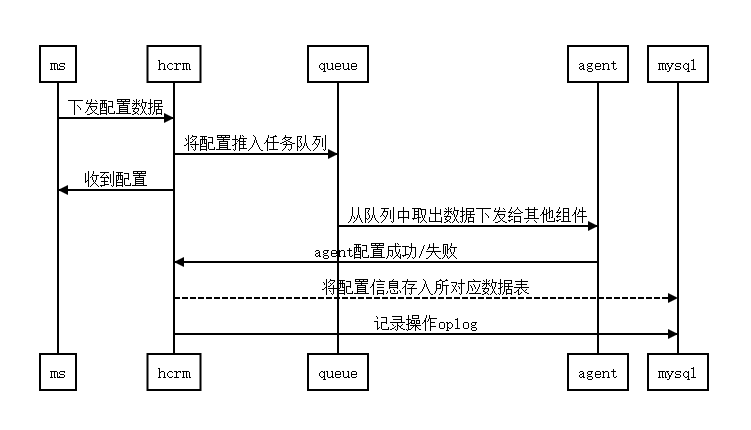
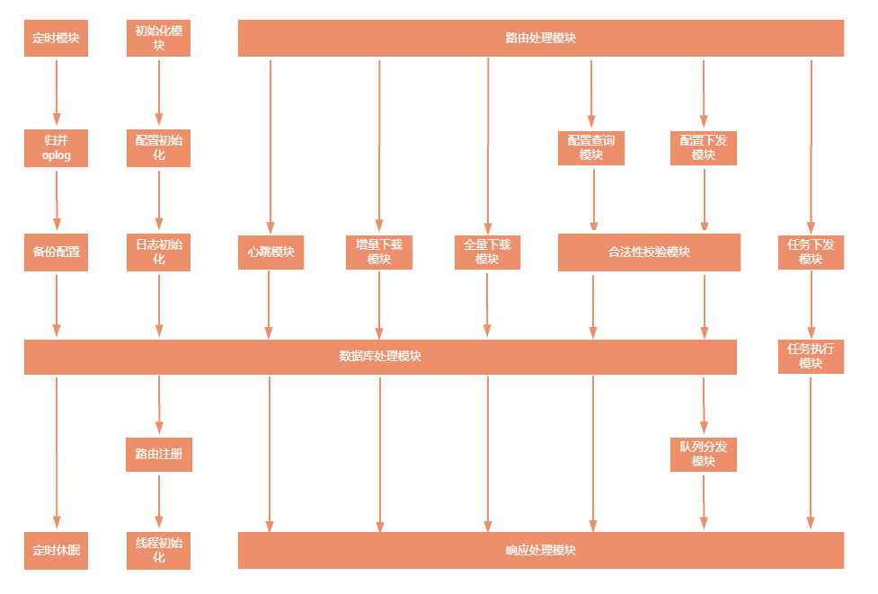

| 版本 | 日期       | 更改记录 | 作者   |
| :--- | :--------- | :------- | ------ |
| 0.1  | 2020-09-23 | 初稿     | 贺伟伟 |

* [概述](#概述)
* [总体设计](#总体设计)
* [接口设计](#接口设计)
* [数据库设计](#数据库设计)
* [删除](#删除)
* [清除](#清除)

------------

## 概述

crm主要为缓存组件，递归组件提供配置。

#### 编写目的

阐述crm功能及设计。

本文档供开发人员、测试人员、技术支持人员参考使用。

#### 背景

在分布式系统下，为各个系统组件提供可靠配置。

便于网管管理。

#### 术语和缩略语

dnsys，dns缓存系统。

zrp，融合标识递归解析系统。

dns，域名系统。

ms，网管。

#### 参考资料

dnsys产品需求文档，dnsys产品概要设计，dnsys api定义。

rfc3650，rfc3651，rfc3652

## 总体设计

#### 需求规定

数据库写入性能10000条/s

#### 运行环境

centos7

#### 设计思想
分布式，多模块化，低耦合。

服务单一原则，易区分，易维护。

#### 系统构思

采用RESTful风格设计的API，采用单一路由。

使用flask自带orm框架flask-sqlalchemy，减少不必要的sql操作。

各个组件采用aiohttp异步处理。

#### 关键数据结构

* 配置

```python
For example:
{
	"contents":
	[
		{
			"source":"ms",
			"id":1,
            "service": "zid",
			"bt":"xforce",
			"sbt":"switch",
			"op":"update",
			"data":{
                "switch":"enable"
            }
		}
	]
}
```

描述

| 名称     | 类型   | 默认值 | 描述                                                         |
| -------- | ------ | ------ | ------------------------------------------------------------ |
| contents | list   | N/A    | **说明**：配置内容<br>**格式**：列表<br>**举例**：[<br/>		{<br/>			"source":"ms",<br/>	        "service":"zid",<br/>		    "id":1,<br/>			"bt":"xforce",<br/>			"sbt":"switch",<br/>			"op":"update",<br/>			"data":{"switch":"enable"}<br/>		}<br/>	] |
| source   | string | N/A    | **说明**：配置来源网管/命令行<br/>**格式**：ms或cli<br/>**举例**：ms |
| service  | string | N/A    | **说明**：配置类型<br/>**格式**：dns/zid<br/>**举例**：dns |
| id       | int    | N/A    | **说明**：版本id<br>**格式**：数字、大于0<br>**举例**：11    |
| bt       | string | N/A    | **说明**：主业务<br/>**格式**：根据实际业务而定<br/>**举例**：xforce |
| sbt      | string | N/A    | **说明**：子业务<br/>**格式**：视实际情况而定<br/>**举例**：rules |
| op       | string | N/A    | **说明**：操作<br/>**格式**：add/update/delete/clear/query<br/>**举例**：query |
| data     | dict   | N/A    | **说明**：配置数据<br/>**格式**：视业务而定<br/>**举例**：{"switch":"enable"} |

* 任务

```python
For example:
{
    "contents":[
        {
            "source":"ms",
            "service":"zid",
            "tasktype":"cachebackup",
            "data":{
                "file":"202008072217123"
            }
        }
    ]
}

```

描述

| 名称     | 类型   | 默认值 | 描述                                                         |
| -------- | ------ | ------ | ------------------------------------------------------------ |
| contents | list   | N/A    | **说明**：任务内容<br>**格式**：列表<br>**举例**：[<br/>		{<br/>			"source":"ms",<br/>	        "service":"zid",<br/>			"tasktype":"cachebackup",<br/>			"data":{"file":"123"}<br/>		}<br/>	] |
| source   | string | N/A    | **说明**：任务来源网管/命令行<br/>**格式**：ms或cli<br/>**举例**：ms |
| service  | string | N/A    | **说明**：任务类型<br/>**格式**：dns/zid<br/>**举例**：dns |
| tasktype | string | N/A    | **说明**：任务类型<br/>**格式**：视实际情况而定<br/>**举例**：cachedelete |
| data     | dict   | N/A    | **说明**：任务数据<br/>**格式**：视任务而定<br/>**举例**：{"file":"xxx"} |

* oplog

```python
For example:
{
    "contents": [
        {
            "action": "add",
            "bt": "ipthreshold",
            "data": {
                "ip": "2.2.2.0/24",
                "threshold": 2222
            },
            "id": 1,
            "reason": "",
            "sbt": "rules",
            "service": "dns",
            "source": "ms",
            "status": "success",
            "vid": 1
        }
    ]
}
```

描述

| 名称     | 类型   | 默认值 | 描述                                                         |
| -------- | ------ | ------ | ------------------------------------------------------------ |
| contents | list   | N/A    | **说明**：oplog内容<br>**格式**：列表<br>**举例**：[<br/>		{<br/>			"source":"ms",<br/>	        "service":"zid",<br/>		    "vid":1,<br/>            "reason":"",<br/>		    "id":1,<br/>			"bt":"xforce",<br/>			"sbt":"switch",<br/>            "status":"success",<br/>			"action":"update",<br/>			"data":{"switch":"enable"}<br/>		}<br/>	] |
| source   | string | N/A    | **说明**：配置来源网管/命令行<br/>**格式**：ms或cli<br/>**举例**：ms |
| service  | string | N/A    | **说明**：配置类型<br/>**格式**：dns/zid<br/>**举例**：dns |
| id       | int    | N/A    | **说明**：ms版本id<br>**格式**：数字、大于0<br>**举例**：11  |
| vid      | int    | N/A    | **说明**：crm版本id<br/>**格式**：数字、大于0<br/>**举例**：11 |
| bt       | string | N/A    | **说明**：主业务<br/>**格式**：根据实际业务而定<br/>**举例**：xforce |
| sbt      | string | N/A    | **说明**：子业务<br/>**格式**：视实际情况而定<br/>**举例**：rules |
| action   | string | N/A    | **说明**：操作<br/>**格式**：add/update/delete/clear/query<br/>**举例**：add |
| status   | string | N/A    | **说明**：状态<br/>**格式**：success/failed<br/>**举例**：success |
| data     | dict   | N/A    | **说明**：配置数据<br/>**格式**：视业务而定<br/>**举例**：{"switch":"enable"} |

* 心跳

```python
For example:
{
    "deviceRelease": "1",
    "deviceVersion": 1,
    "licenseInfo": {},
    "msRelease": "1",
    "msVersion": 1,
    "softwareVersion": "1.0",
    "status": "running"
}

```

描述（待补充）

#### 系统总体结构

crm主要处理网管ms或者命令行工具cli所下发的配置，包括增加删除修改更新等操作，同时将收到配置同步下发给各个组件。自身能够区分不同版本配置差异。各模块之间采用restful接口，数据组织形式为json。

#### 基本处理流程

读取配置文件，初始化日志。

线程初始化，配置，重试，定时任务等线程开始工作。

路由初始化，url监听。路由注册。

#### 系统流程图


#### 数据流程图

- 配置数据流

crm收到下发配置，将原始数据推入任务队列，回复ms收到配置数据，此后开始异步处理，根据数据需求转发配置给各个组件，此后收到成功回复说明配置成功，成功配置后将数据更新到对应数据表中，记录oplog。未收到成功回复，则说明配置失败，则将失败的oplog存入oplog表即可。





- 任务数据流

crm收到下发任务，将原始数据推入任务队列，写入数据库生成任务id，回复ms任务id。此后开始同步处理，根据任务需求转发任务给各个组件，此后收到任务结果更新任务结果到数据库。


#### 功能模块关系




## 模块设计

任务模块，配置处理模块，定时模块，同步模块，路由模块。

#### 配置处理

crm收到ms配置后进行校验，校验失败则记录oplog，返回收到，后续通过心跳获取配置结果，校验成功则加入配置队列，返回收到配置，后续工作线程从队列取出数据进行分发，获得配置结果后更新配置数据以及oplog。


#### 任务处理

crm收到ms任务后进行校验，校验失败返回异常，校验成功则加入任务队列，将任务数据写入mysql，生成任务id并返回给ms，后续任务线程从队列取出数据进行任务分发，获得任务执行结果后更新到任务数据表。


#### 数据处理

从配置队列取出数据进行分发的过程，不同数据需要分发给不同组件，分发时依据主业务类型进行分发，dns的配置转发给dnsys或ybind，zid的配置分发给proxy，xforward，recursion和内核。


#### 路由注册

flask端口监听，初始化各个路由，目前有心跳，增量，全量，注册，配置。


#### 同步模块

网管与设备之间定时发起心跳消息，协商双方的配置版本。实现CLI配置通知、生效状态以及网管配置下发功能。

网管记录设备的oplog版本（设备大版本，cli版本，告警版本，生效状态版本），只会获取该版本之后的修改配置。 

同步最核心的就是网管按照一定时间向crm发送心跳请求，crm将自己的版本id和网管id返回，网管根据crm返回的版本id判断是否需要获取配置结果，若返回的版本id大于网管保存的crm版本id，则需要调用增量传输接口获取配置结果。若返回的版本id与网管保存的crm版本id相同，则不需要任何操作，若crm返回的版本id小于网管保存的crm版本id，则说明crm有些配置未收到，可能crm离线或者网络问题导致，后续crm上线需要网管触发重发配置。


#### 定时模块

定时模块主要是定时执行一些任务，如检查数据库是否有垃圾数据，配置备份等。


## 接口设计

#### 接口概览

| URL                                              | 方法                | 描述                  |
| ------------------------------------------------ | ------------------- | --------------------- |
| http://$HOST:$PORT/api/v1.0/internal/configs     | GET/POST/PUT/DELETE | [配置](#配置)         |
| http://$HOST:$PORT/api/v1.0/internal/tasks       | POST/GET/DELETE     | [任务](#任务)         |
| http://$HOST:$PORT/api/v1.0/internal/status      | GET                 | [心跳](#心跳)         |
| http://$HOST:$PORT/api/v1.0/internal/oplog       | GET                 | [增量传输](#增量传输) |
| http://$HOST:$PORT/api/v1.0/internal/all-configs | POST                | [全量传输](#全量传输) |

#### 配置

功能：向crm下发配置。

请求路由：[http://$HOST:$PORT/api/v1.0/internal/configs](http://$HOST:$PORT/api/v1/version?dmsVersion=100)

请求方法：POST/DELETE/PUT

请求数据：配置数据

响应结果：200 OK

响应数据：响应报文 参见 HyperZid_API.md

#### 心跳

功能：网管与设备之间定时发起心跳消息，协商双方的配置版本，保持配置一致。

请求路由：[http://$HOST:$PORT/api/v1.0/internal/status](http://$HOST:$PORT/api/v1/version?dmsVersion=100)

请求方法：GET

请求数据：无

响应结果：200 OK

响应数据：心跳数据

#### 增量

功能：传输crm收到配置的执行结果

请求路由：[http://$HOST:$PORT/api/v1.0/internal/oplog](http://$HOST:$PORT/api/v1/version?dmsVersion=100)

请求方法：GET

请求参数：startVersion=1&&limit=100

请求数据：无

响应结果：200 OK

响应数据：增量oplog

#### 全量

功能：传输crm收到配置成功的全量配置

请求路由：[http://$HOST:$PORT/api/v1.0/internal/all-configs](http://$HOST:$PORT/api/v1/version?dmsVersion=100)

请求方法：POST

请求数据：无

响应结果：200 OK

响应数据：全量配置 参见HyperZid_API.md

#### 任务

功能：向各个组件下发任务

请求路由：[http://$HOST:$PORT/api/v1.0/internal/tasks](http://$HOST:$PORT/api/v1/version?dmsVersion=100)

请求方法：POST

请求数据：根据不同任务而定

响应结果：200 OK

响应数据：具体任务结果 参见HyperZid_API.md


- 配置详细接口参见 HyperAdmin_API.md  HyperDns_API.md  HyperZid_API.md


## 数据库设计

- oplog表

| 名称    | 类型   | 默认值 | 描述         |
| :------ | :----- | :----- | :----------- |
| vid     | Int    | N/A    | 设备版本id   |
| id      | Int    | N/A    | ms版本id     |
| bt      | String | N/A    | 主业务       |
| sbt     | String | N/A    | 子业务       |
| action  | String | N/A    | 执行动作     |
| service | String | N/A    | 服务         |
| source  | String | N/A    | 配置来源     |
| status  | String | N/A    | 配置状态     |
| reason  | String | N/A    | 配置失败原因 |
| data    | Text   | N/A    | 配置数据     |

* ip列表

| 名称 | 类型   | 默认值 | 描述   |
| :--- | :----- | :----- | :----- |
| id   | Int    | N/A    | 主键   |
| bt   | String | N/A    | 主业务 |
| sbt  | String | N/A    | 子业务 |
| ip   | String | N/A    | ip     |

* 标识列表

| 名称 | 类型   | 默认值 | 描述   |
| :--- | :----- | :----- | :----- |
| id   | Int    | N/A    | 主键   |
| bt   | String | N/A    | 主业务 |
| sbt  | String | N/A    | 子业务 |
| tag  | String | N/A    | 标识   |

* 开关

| 名称   | 类型   | 默认值 | 描述     |
| :----- | :----- | :----- | :------- |
| id     | Int    | N/A    | 主键     |
| bt     | String | N/A    | 主业务   |
| sbt    | String | N/A    | 子业务   |
| switch | String | N/A    | 开关状态 |

* 标识限速

| 名称  | 类型   | 默认值 | 描述   |
| :---- | :----- | :----- | :----- |
| id    | Int    | N/A    | 主键   |
| bt    | String | N/A    | 主业务 |
| sbt   | String | N/A    | 子业务 |
| tag   | String | N/A    | 标识   |
| meter | Int    | N/A    | 限速值 |

* ip限速

| 名称  | 类型   | 默认值 | 描述   |
| :---- | :----- | :----- | :----- |
| id    | Int    | N/A    | 主键   |
| bt    | String | N/A    | 主业务 |
| sbt   | String | N/A    | 子业务 |
| ip    | String | N/A    | ip     |
| meter | Int    | N/A    | 限速值 |

* 递归转发

| 名称  | 类型   | 默认值 | 描述 |
| :---- | :----- | :----- | :--- |
| id    | Int    | N/A    | 主键 |
| group | String | N/A    | 组名 |
| ip    | String | N/A    | ip   |
| proto | String | N/A    | 协议 |
| port  | Int    | N/A    | 端口 |

* 协议管理

| 名称   | 类型   | 默认值 | 描述 |
| :----- | :----- | :----- | :--- |
| id     | Int    | N/A    | 主键 |
| action | String | N/A    | 动作 |
| ipv4   | String | N/A    | ipv4 |
| ipv6   | String | N/A    | ipv6 |
| proto  | String | N/A    | 协议 |
| port   | Int    | N/A    | 端口 |

* 证书管理

| 名称    | 类型   | 默认值 | 描述 |
| :------ | :----- | :----- | :--- |
| id      | Int    | N/A    | 主键 |
| ca_cert | String | N/A    | cert |
| rsa_key | String | N/A    | key  |

- 强制解析

| 名称      | 类型   | 默认值 | 描述     |
| :-------- | :----- | :----- | :------- |
| id        | Int    | N/A    | ms版本id |
| zid    | String | N/A    | 标识     |
| rcode     | Int    | N/A    | 返回码   |
| timestamp | Int    | N/A    | 时间     |
| ttl       | Int    | N/A    | 服务     |
| values    | String | N/A    | 值       |

* 健康检查

| 名称   | 类型   | 默认值 | 描述 |
| :----- | :----- | :----- | :--- |
| id     | Int    | N/A    | 主键 |
| switch | String | N/A    | 开关 |
| cycle  | Int    | N/A    | 周期 |

- 任务

| 名称        | 类型   | 默认值 | 描述     |
| :---------- | :----- | :----- | :------- |
| id          | Int    | N/A    | 主键     |
| rcode       | Int    | N/A    | 返回码   |
| type        | String | N/A    | 任务类型 |
| status      | String | N/A    | 状态     |
| start       | String | N/A    | 开始时间 |
| end         | String | N/A    | 结束时间 |
| description | String | N/A    | 描述     |
| data        | Text   | N/A    | 任务数据 |
| result      | Text   | N/A    | 执行结果 |


